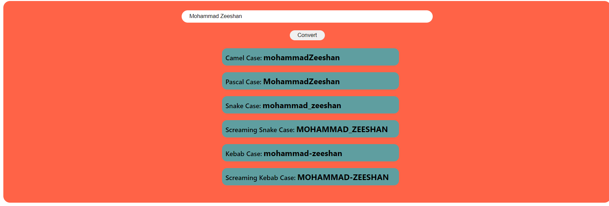

# Name Conversion

### Full Stack Javascript Web Devlopment Assingment (FSJS) 

 
 
 
### - About Working of this Project

In this project i have made a Case converter Which Convert a normal String into Six diffrent Types of case   

-Camel Case.  
-Pascal Case.  
-Snake Case.  
-Screaming Snake Case.  
-Kebab Case.  
-Screaming Kebab Case.  
 
 
 

 
 
 
